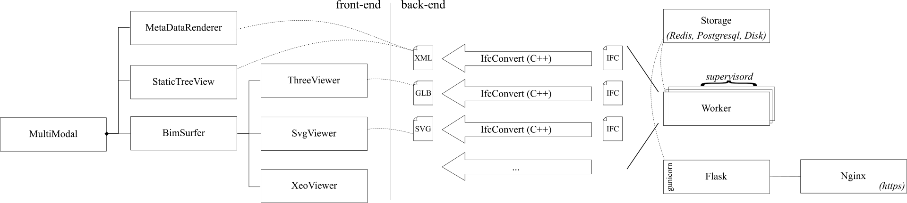

# ifc-pipeline

A processing queue that uses [IfcOpenShell](https://github.com/IfcOpenShell/IfcOpenShell/) to convert IFC input files into a graphic display using glTF 2.0 and [BIMSurfer2](https://github.com/AECgeeks/BIMsurfer2/) for visualization.

There is a small web application in Flask that accepts file uploads. HTTPS is provided by Nginx. Everything is tied together using Docker Compose.

## Architecture

There is a front-end in flask with the following routes:

- `GET /` HTML front-page with upload  
- `POST /` Form post upload. Redirects to `/p/<id>`.
- `GET /p/<id>` HTML progress page
- `GET /pp/<id>` JSON progress
- `GET /log/<id>.<ext>` Conversion log. ext: html|json
- `GET /v/<id>` HTML viewer page
- `GET /m/<id>.<ext>` Artefact download. ext eg: xml|svg|glb

In the backend there is a worker process that uses IfcOpenShell's IfcConvert to convert the incoming IFC models into XML (for decomposition structure and property set data), glTF for 3D geometry and SVG for 2D floor plan geometry.

Communication between the Flask web-app and the task queue is by means of the Rq library and a postgres database. Input and output files are stored on disk in a docker volume shared between the two containers.

Nginx is used a reverse proxy with HTTPS where certbot will automatically create and renew the certificates.

In the front-end the BIMsurfer2 viewer module takes the various converted artefacts for display.

## Local development

Clone the ifc-pipeline repo recursively (with submodules)

See `application/Dockerfile` for setup instructions for the python dependencies

### Linux

This will setup an environment for easy development, without Docker, which uses sqlite instead of postgresql and Python threads instead of the redis-backed RQ processing queue.

~~~sh
cd application

python -m pip -r requirements.txt

# Download the IfcConvert binary
mkdir nix
cd nix/
wget https://s3.amazonaws.com/ifcopenshell-builds/IfcConvert-v0.7.0-2985bba-linux64.zip
unzip IfcConvert-v0.7.0-2985bba-linux64.zip
chmod +x IfcConvert
cd ..

# Install IfcOpenShell-python
wget -O /tmp/ifcopenshell_python.zip https://s3.amazonaws.com/ifcopenshell-builds/ifcopenshell-python-`python3 -c 'import sys;print("".join(map(str, sys.version_info[0:2])))'`-v0.7.0-2985bba-linux64.zip
mkdir -p `python3 -c 'import site; print(site.getusersitepackages())'`
unzip -d `python3 -c 'import site; print(site.getusersitepackages())'` /tmp/ifcopenshell_python.zip

# Run flask with dev environment variables
./run_debug.sh
~~~

### Windows

* Download https://s3.amazonaws.com/ifcopenshell-builds/IfcConvert-v0.7.0-2985bba-win64.zip
* Extract and unzip and place IfcConvert.exe in a newly created directory `.\application\win\IfcConvert.exe`
* Lookup you python version with: `python -c "import sys; print(sys.version_info);"`
* Take the `major` and `minor` number and replace the `XY` in the URL below with those numbers. For for Python 3.10.x use `31`
* Download https://s3.amazonaws.com/ifcopenshell-builds/ifcopenshell-python-XY-v0.7.0-2985bba-linux64.zip
* Take note of your python site-packages directory with `python -c "import site; print(site.USER_SITE)"`
* Extract and unzip and place into the site-packages folder of your python interpreter
* The result should be a directory structure with `...\site-packages\ifcopenshell\__init__.py`
* Use run_debug.bat to start the application

## Production deployment

Install docker and docker-compose using the relevant guides for your operating system and then proceed with the two following steps.

~~~
# Do first time registration with certbot
# Further renewals will happen automatically.
./init.sh my.domain.name.com

# Start the service using docker-compose
docker-compose up -d
~~~

The service creates a fair amount of data for incoming files. Users are advised to setup a large disk for the storage of models and implement their own vacuuming strategy to remove stale files.

For example to remove old files (which can be ran periodically using cron).

~~~sh
find ./ifc-pipeline/models -mtime +30 -delete
~~~

By default the nginx container listens on 80 and 443. Edit docker-compose.yml to change.

### Maintenance commands

* get queue info

  `docker exec -it $(docker ps -q --filter name=worker) rq info`
    
* open a remote python shell and print task information

  ~~~
  docker exec -it $(docker ps -q --filter name=worker) python -c "
  import json, database, datetime;
  s = database.Session(); 
  print(json.dumps([m.serialize() for m in s.query(database.model).filter(database.model.date+datetime.timedelta(days=2)>datetime.datetime.now()).order_by(database.model.date).all()], default=str))
  "
  ~~~
